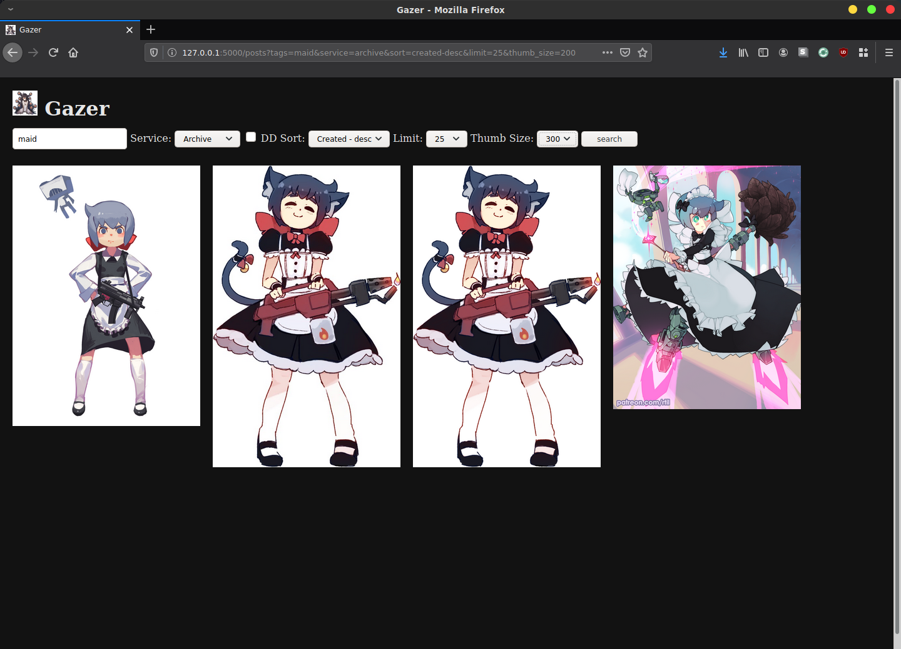

# Gazer

This is an experimental booru client and image archive tool I made to consolidate
my own image browsing and archiving habits. It combines a simple locally running
image booru with a client for browsing some of the common booru sites. (gelbooru,
yandere, konachan, etc) and has a simple scraper for automatic downloading.

## Features
Application runs in a local web server rather than as a traditional gui interface.
Can be used either locally on a single computer or accessed over a local area
network (for example from a homeserver or media pc).
### Local Booru
<p>
<p>
- mirrors all tags from source
- tag and multitag search
- viewing statistics (by image and by tag)
- sort by date created/score/local views
- adjust thumbnail size
- adjust thumbnails per page

### Booru Client:
<p>
- supports gelbooru and moebooru based sites
- uses locally cached images when possible (saves bandwidth)
- 1 click archiving in client

### Scraper
<p>
- supports gelbooru and moebooru based sites
- scrape and archive posts based on any tag or set of tags

### Deep Danbooru Integration

- local archive has extra tags inferred from image using machine learning black magic
- inferred tags fully searchable, enabled via toggle

### Why not use hydrus or x other software

I found hydrus to have a lot more features than I needed. What I really wanted
was just a personally curated booru with an easy way to browse and archive new images.

## Running

Code is still very experimental so I don't have a nice packaging solution ready,
needs to be run from commandline and accessed via browser.

### Linux/Unix/Mac
Install any version of python3 then navigate to the gazer root directory and
run the following commands in your terminal client.
```
python -m venv venv
source venv/bin/activate
python setup.py install
python gazer
```
Open a browser and go to
localhost:5000 or 127.0.0.1:5000

#### Enable DeepDanbooru Integration

```
chmod +x enable_dd.sh
./enable_dd.sh
```

### Windows
Install any version of python3 then navigate to the gazer root directory and
run the following commands in your terminal client.
```
python -m venv venv
.\venv\Scripts\activate
python setup.py install
python gazer
```
Open a browser and go to
localhost:5000 or 127.0.0.1:5000

### Docker
If you have docker set up you can use the included dockerfile to run the service.
Note by default this dockerfile has deepdanbooru integration enabled.

```
docker build -t gazer .
docker run -p 5000:5000 gazer
```
Open a browser and go to
localhost:5000 or 127.0.0.1:5000

## Getting Started

### Setup Auto Scraper

Find the configuration file at `gazer/gazer/scraper_data/tag_set.json`

```
[
{"name":"Cute Autist", "source":"safebooru", "tags": ["constanze_amalie_von_braunschbank-albrechtsberger", "1girl"]}
]
```

You can edit this file to have any number of "tag sets". Each tag set must have 1 or
more tags and list a supported booru to download these images from as its source ie.

```
[
{"name":"Cute Autist", "source":"safebooru", "tags": ["constanze_amalie_von_braunschbank-albrechtsberger", "1girl"]},
{"name":"Cute Maid Autist with gun", "source":"safebooru", "tags": ["constanze_amalie_von_braunschbank-albrechtsberger", "maid", "gun"]}
]
```

Scraper will attempt to download all images from the source that match your tags.
The scraper will automatically start with gazer. If you update your tags in the config
file while gazer is running or want to scrape any new images: go to 127.0.0.1:5000/scraper
and press the 'restart' button.  
